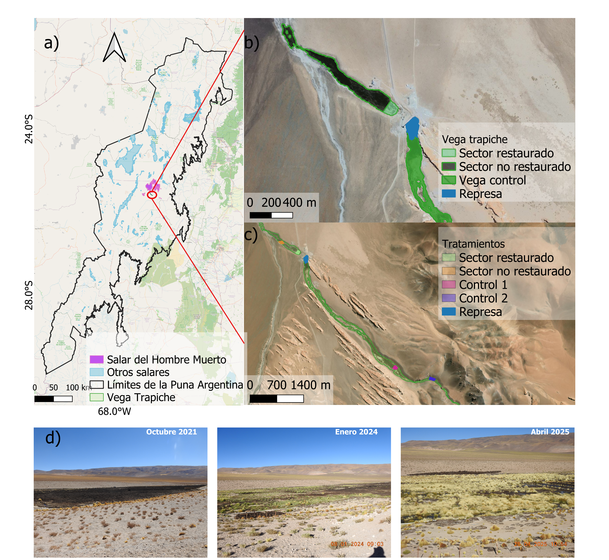
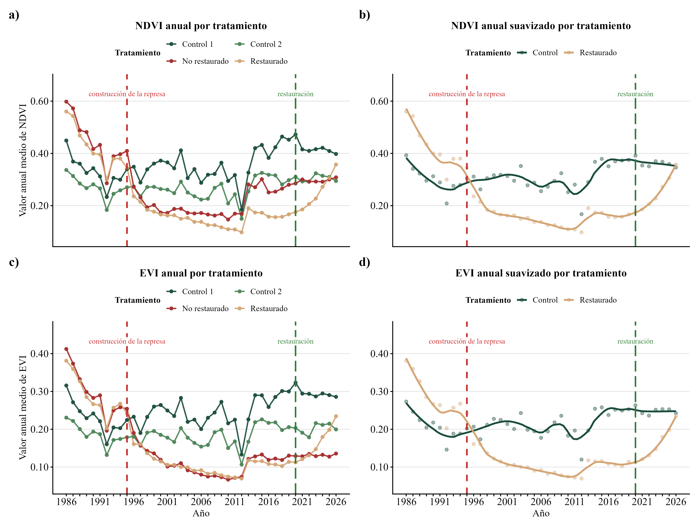
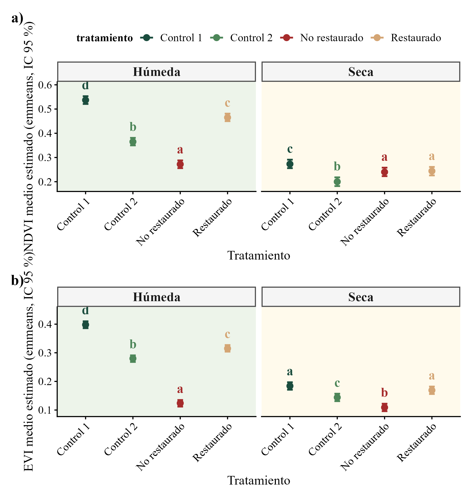
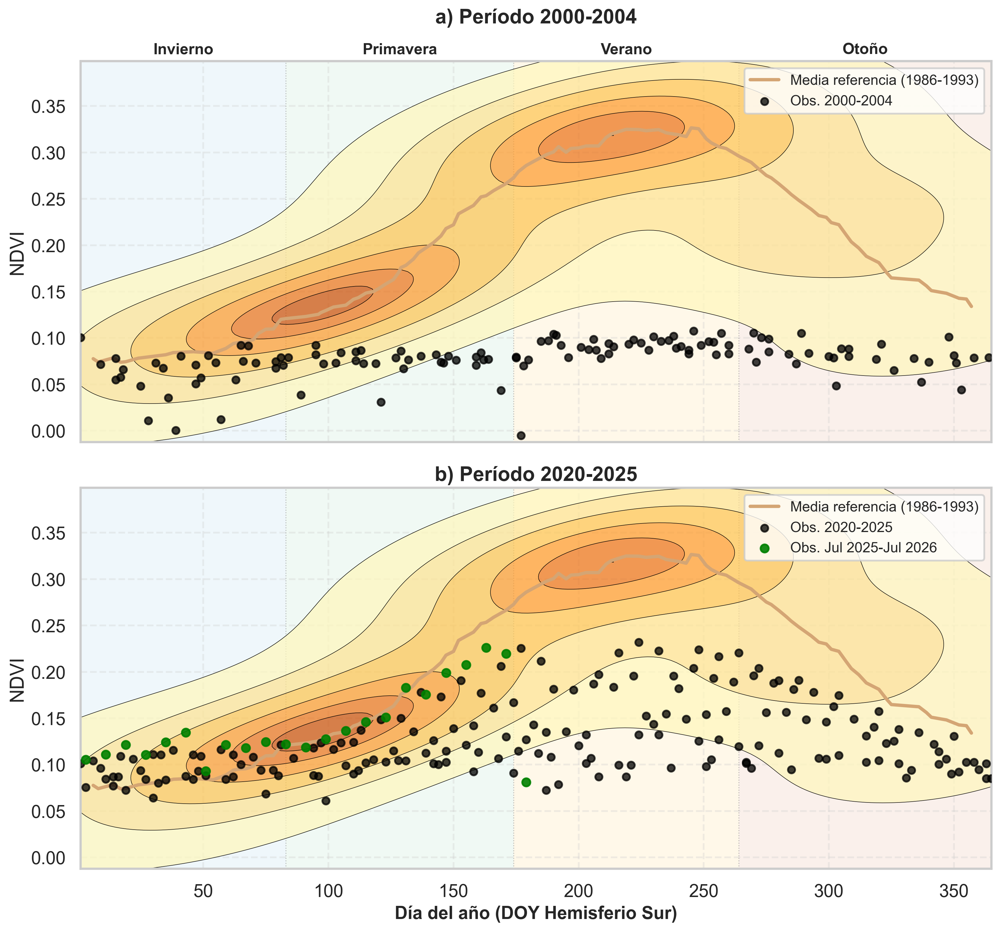

# Restauración de la vega de Trapiche (Salar del Hombre Muerto, Puna argentina)

Monitoreo satelital multi-sensor (Landsat 1986–2026, Sentinel-2 2016–2026, MODIS 2000–2026) del efecto de la construcción de una represa y de acciones de restauración activa sobre los índices de vegetación y humedad de una vega altoandina (humedal de altura) ubicada en la cuenca del Salar del Hombre Muerto, Puna de Catamarca/Salta, Argentina.

Este repositorio contiene el código, los datos tabulares extraídos de Google Earth Engine y las figuras utilizadas en el artículo científico asociado. **Los scripts, datos y figuras aquí publicados son los que efectivamente se usaron para producir los resultados del manuscrito**; se ofrecen para transparencia y reproducibilidad del análisis.

<p align="center">
  
</p>

**Figura 1.** a) Localización de la vega de Trapiche en la Puna argentina, cerca del Salar del Hombre Muerto. b–c) Sectores de tratamiento delimitados sobre imagen satelital: sector restaurado, sector no restaurado, vegas control (Control 1 y Control 2) y la represa. d) Secuencia fotográfica del proceso de restauración en el sector intervenido (octubre 2021 – abril 2025).

## Contexto del estudio

La vega de Trapiche fue afectada por la construcción de una represa hacia mediados de los años 1990, que alteró el régimen hídrico de un sector del humedal. A partir de 2020–2021 se implementaron acciones de restauración activa (plantación, obras de re-humectación) en parte del sector degradado. El diseño de monitoreo compara cuatro unidades de tratamiento a lo largo del tiempo:

- **Sector restaurado**: área degradada por la represa que recibió intervención de restauración.
- **Sector no restaurado**: área degradada por la represa que no fue intervenida (control de degradación).
- **Control 1** y **Control 2**: sectores de vega no afectados por la represa, usados como referencia del estado de vegetación "sano" de la vega.

Sobre esas cuatro unidades se calcularon series temporales de índices espectrales (NDVI, EVI, SAVI, NDWI, LSWI y temperatura superficial LST) a partir de tres sensores satelitales con distinta resolución espacial y temporal, y se evaluó estadísticamente si el sector restaurado se recupera hacia los valores de los sectores control.

## Estructura del repositorio

```
Analisis/
├── LICENSE                                # Licencia MIT (código)
├── DATA_LICENSE                           # Licencia CC BY 4.0 (datos y figuras)
├── README.md
├── data/                                  # Series extraídas de Google Earth Engine (una fila = un píxel en una fecha)
│   ├── datos_trapiche_landsat.csv         # Landsat 5/7/8/9, 1986-2026, escala 30 m
│   ├── datos_trapiche_sentinel.csv        # Sentinel-2 SR, 2016-2026, escala 10 m
│   └── datos_trapiche_modis.csv           # MODIS MOD09GQ/MYD09GQ, 2000-2026, escala 250 m
│
├── scripts/
│   ├── 1-download scripts/                # Descarga y actualización de datos desde Earth Engine (Python)
│   │   ├── trapiche_landsat_download.py
│   │   ├── trapiche_sentinel_download.py
│   │   └── trapiche_modis_download.py
│   │
│   ├── 2-graphics scripts/                # Generación de las figuras del manuscrito (R y Python)
│   │   ├── figure_style.R                 # Paleta y tema gráfico compartidos
│   │   ├── generate_landsat_figures.R     # Figuras 2, 3 y 4 (series anuales Landsat)
│   │   ├── generate_sentinel_figures.R    # Figuras 5 y 6 (series mensuales y emmeans Sentinel-2)
│   │   ├── generate_figure7_kde.py        # Figura 7 (densidad fenológica de referencia)
│   │   ├── generate_restoration_photos_figure.R  # Figura S3 (panel fotográfico de restauración)
│   │   └── ndvi_vega_trapiche.py          # Mapas NDVI comparados por período (composiciones Landsat)
│   │
│   └── 3-analysis scripts/
│       └── Analisis Sentinel 2.R          # Modelos lineales mixtos, ANOVA, emmeans/CLD y tablas del manuscrito
│
├── figures/                               # Figuras finales (PNG) usadas en el manuscrito
│
└── visualizacion escenas/                 # Exploración interactiva de escenas Landsat individuales (HTML)
    ├── download_landsat_dates_1994_1995.py
    ├── landsat_dates_1994_1995_dashboard.html
    ├── landsat_seasons_dashboard.html
    └── .../*_images/                      # Composiciones RGB, NDVI, EVI y NDWI por escena/temporada
```

> Nota: los scripts en `2-graphics scripts/` y `3-analysis scripts/` originalmente resolvían la raíz del proyecto asumiendo que vivían un solo nivel bajo `Analisis/` (con carpetas `Scripts/` y `Figures/` en mayúscula), en lugar de dos niveles (`scripts/2-graphics scripts/`, `scripts/3-analysis scripts/`, con `data/` y `figures/` en minúscula), que es la estructura real de esta carpeta. Ese desajuste — heredado de haber copiado los scripts desde otra organización de carpetas — ya fue corregido en este repositorio: todos resuelven la raíz del proyecto de forma robusta a partir de la ubicación real del script. La única dependencia externa pendiente es la carpeta `anexosfiguras/` (fotografías originales de la restauración) que usa `generate_restoration_photos_figure.R`: no forma parte de este repositorio porque las figuras que genera (`Figure_Restauracion_Paneles.png`, `FigureS3.png`) ya están incluidas en `figures/`; para volver a generarlas hay que crear esa carpeta en la raíz y copiar allí las 4 fotos originales.

## Datos (`data/`)

Cada archivo CSV contiene una fila por combinación de punto de muestreo (píxel) y fecha de adquisición de la escena, con los índices espectrales ya calculados en Earth Engine.

| Archivo | Sensor(es) | Período | Resolución | Nº de píxeles | Columnas |
|---|---|---|---|---|---|
| `datos_trapiche_landsat.csv` | Landsat 5 TM, 7 ETM+, 8/9 OLI (Collection 2, Nivel 2) | 1986–2026 | 30 m | 74 | `Point_ID`, `tratamiento`, `Year`, `Date`, `NDVI`, `EVI`, `SAVI`, `LST`, `NDWI`, `LSWI`, `Snow` |
| `datos_trapiche_sentinel.csv` | Sentinel-2 (S2_SR_HARMONIZED) | 2016–2026 | 10 m | 334 | `Point_ID`, `tratamiento`, `Year`, `Date`, `NDVI`, `EVI`, `SAVI`, `NDWI`, `LSWI`, `Snow` |
| `datos_trapiche_modis.csv` | MODIS Terra/Aqua (MOD09GQ/MYD09GQ) | 2000–2026 | 250 m | 2 | `Point_ID`, `tratamiento`, `Year`, `Date`, `Red`, `NIR`, `NDVI`, `SAVI` |

`tratamiento` toma los valores `control 1`, `control 2`, `sector restaurado` y `sector no restaurado`. `Snow` indica píxeles marcados como nieve/hielo por la máscara de calidad del sensor (excluidos de los análisis).

## Scripts de descarga (`scripts/1-download scripts/`)

Scripts en Python que usan la API de Google Earth Engine (`earthengine-api` + `geemap`) para extraer, en los puntos de muestreo definidos como assets de Earth Engine (`users/CarlosNavarro/Trapiche_NDVI/...`), las bandas de reflectancia superficial y calcular los índices espectrales:

- **NDVI** = (NIR − Red) / (NIR + Red)
- **EVI** = 2.5 · (NIR − Red) / (NIR + 6·Red − 7.5·Blue + 1)
- **SAVI** = 1.5 · (NIR − Red) / (NIR + Red + 0.5)
- **NDWI** = (Green − NIR) / (Green + NIR)
- **LSWI** = (NIR − SWIR1) / (NIR + SWIR1)
- **LST** (solo Landsat) = banda térmica escalada, en °C

Cada script aplica una máscara de calidad específica del sensor (`QA_PIXEL`/`QA_RADSAT` en Landsat, `SCL` en Sentinel-2, `QC_250m` en MODIS) para descartar nubes, sombras, nieve y píxeles saturados, además de listas de escenas excluidas manualmente por contaminación de nubes residual detectada por inspección visual. Los scripts de Landsat y Sentinel-2 son incrementales: si el CSV de salida ya existe, solo descargan y agregan las fechas faltantes del año en curso.

## Scripts de figuras (`scripts/2-graphics scripts/`)

`figure_style.R` centraliza la paleta de colores por tratamiento y el tema gráfico (`ggplot2`/`patchwork`) para que todas las figuras del manuscrito sean visualmente consistentes.

- **`generate_landsat_figures.R`** → `Figure2.png`, `Figure3.png`, `Figure4.png`. Agrega los datos Landsat a medianas espaciales mensuales y luego a promedios por año hidrológico/fenológico (julio–junio), y grafica la trayectoria 1986–2026 de NDVI, EVI, LSWI y LST por tratamiento, marcando el año de construcción de la represa (1995) y el inicio de la restauración (2020).
- **`generate_sentinel_figures.R`** → `Figure5.png` / `Figure5_controles_separados.png` (series mensuales 2020–2026 de NDVI/EVI/LSWI) y `Figure6_a.png` / `Figure6_b.png` (medias marginales estimadas del modelo mixto, con intervalos de confianza al 95 % y letras de significancia de Tukey, comparando época húmeda vs. seca).
- **`generate_figure7_kde.py`** → `Figure7.png`. Compara la densidad fenológica bidimensional (día del año vs. NDVI) del sector restaurado durante el período de referencia pre-represa (1986–1993) contra las observaciones de 2000–2004 y 2020–2026, resaltando en verde las observaciones más recientes (julio 2025–julio 2026).
- **`generate_restoration_photos_figure.R`** → `Figure_Restauracion_Paneles.png` / `FigureS3.png`. Panel de 4 fotografías de campo que documentan el proceso físico de restauración (pozos de plantado, plantación 2022, consolidación 2023 y 2025).
- **`ndvi_vega_trapiche.py`** → mapas NDVI comparativos (2×2) por período (1986–1993, 2000–2004, 2005–2009, 2025–2026) a partir de composiciones medianas de Landsat, para visualizar espacialmente el patrón de degradación/recuperación.

## Script de análisis estadístico (`scripts/3-analysis scripts/Analisis Sentinel 2.R`)

Contiene el análisis estadístico principal del manuscrito sobre los datos Sentinel-2 (mayor densidad temporal), estructurado en:

1. **Limpieza y colapso de datos**: filtrado desde julio de 2024, exclusión de valores de NDVI/EVI fuera de rango físico [-1, 1] y de píxeles con nieve, y colapso a un valor por píxel-fecha-tratamiento (mediana).
2. **Control de calidad de escenas**: se exigen escenas con ≥80 % de cobertura de píxeles válidos en las 4 unidades de tratamiento, y se descartan fechas cuyo EVI cae anómalamente por debajo de la mediana móvil local (residuo < −0.045), como filtro adicional de nubes/sombras no capturadas por la máscara SCL.
3. **Modelos lineales mixtos (LMM)**: para cada índice (NDVI, EVI, LSWI, SAVI) se ajusta `valor ~ tratamiento * época + (1 | fecha_de_escena)` con `lme4`/`lmerTest`, usando la fecha de escena como efecto aleatorio para evitar pseudo-replicación entre píxeles de una misma imagen.
4. **Inferencia**: ANOVA tipo III con aproximación de Satterthwaite para los grados de libertad, medias marginales estimadas (`emmeans`) por tratamiento dentro de cada época (húmeda: nov–abr; seca: may–oct), comparaciones pareadas de Tukey y letras de significancia (CLD).
5. **Salidas**: gráficos estandarizados por índice (evolución estacional, boxplots, emmeans con letras) y tablas de coeficientes, ANOVA, letras CLD, comparaciones pareadas y estadística descriptiva, exportadas como CSV para el material suplementario.

El índice NDWI se excluye deliberadamente de este análisis por estar orientado a contenido de agua superficial más que a vigor de vegetación, fuera del alcance de las preguntas del estudio.

## Figuras (`figures/`)

| Figura | Contenido |
|---|---|
| `Figure1.png` | Mapa de ubicación y delimitación de tratamientos + secuencia fotográfica de restauración |
| `Figure2.png` | NDVI y EVI anuales por tratamiento, 1986–2026 (Landsat), observado y suavizado |
| `Figure3.png` | LSWI anual por tratamiento (Landsat) |
| `Figure4.png` | Temperatura superficial (LST) anual por tratamiento (Landsat) |
| `Figure5.png` / `Figure5_controles_separados.png` | Series mensuales 2020–2026 de NDVI, EVI y LSWI (Sentinel-2) |
| `Figure6_a.png` / `Figure6_b.png` | Medias marginales estimadas (emmeans) con letras de Tukey, y boxplots, por época húmeda/seca (Sentinel-2) |
| `Figure7.png` | Densidad fenológica NDVI de referencia (1986–1993) vs. períodos 2000–2004 y 2020–2026 |
| `FigureS2.png` | Material suplementario |
| `FigureS3.png` (= `Figure_Restauracion_Paneles.png`) | Panel fotográfico del proceso de restauración |

<p align="center">
  
</p>

**Figura 2.** Trayectoria anual (año fenológico julio–junio) de NDVI (a–b) y EVI (c–d) por tratamiento entre 1986 y 2026. Las líneas verticales marcan la construcción de la represa (1995, rojo) y el inicio de la restauración (2020, verde).

<p align="center">
  
</p>

**Figura 6a.** Medias marginales estimadas (emmeans, IC 95 %) de NDVI (arriba) y EVI (abajo) por tratamiento, en época húmeda y seca. Letras distintas indican diferencias significativas (Tukey) dentro de la misma época.

<p align="center">
  
</p>

**Figura 7.** Densidad fenológica bidimensional del sector restaurado en el período de referencia pre-represa (1986–1993, contornos) comparada con las observaciones de 2000–2004 (a) y 2020–2026 (b); en verde, las observaciones más recientes (jul. 2025–jul. 2026).

## `visualizacion escenas/`

Herramientas complementarias (no forman parte de las figuras del manuscrito) para inspeccionar visualmente escenas Landsat individuales: `download_landsat_dates_1994_1995.py` descarga composiciones RGB, NDVI, EVI y NDWI por fecha/temporada desde Earth Engine, y los archivos `.html` son tableros interactivos generados a partir de esas imágenes para revisión de calidad de escenas (nubes, sombras, nieve) durante el control de calidad de los datos.

## Cómo reproducir

**Descarga de datos (Python + Google Earth Engine):**

```bash
pip install earthengine-api geemap pandas
earthengine authenticate   # solo la primera vez
python "scripts/1-download scripts/trapiche_landsat_download.py"
python "scripts/1-download scripts/trapiche_sentinel_download.py"
python "scripts/1-download scripts/trapiche_modis_download.py"
```

Requiere acceso a los assets de Earth Engine `users/CarlosNavarro/Trapiche_NDVI/*` (puntos de muestreo geolocalizados por sector de tratamiento).

**Figuras (R):**

```r
install.packages(c("readr", "dplyr", "tidyr", "lubridate", "ggplot2",
                    "patchwork", "scales", "stringr", "jpeg"))
Rscript "scripts/2-graphics scripts/generate_landsat_figures.R"
Rscript "scripts/2-graphics scripts/generate_sentinel_figures.R"
Rscript "scripts/2-graphics scripts/generate_restoration_photos_figure.R"
```

**Figuras (Python):**

```bash
pip install pandas numpy matplotlib seaborn scipy
python "scripts/2-graphics scripts/generate_figure7_kde.py"
```

**Análisis estadístico (R):**

```r
install.packages(c("tidyverse", "lme4", "lmerTest", "emmeans",
                    "multcomp", "lubridate", "patchwork"))
Rscript "scripts/3-analysis scripts/Analisis Sentinel 2.R"
```

## Notas metodológicas

- **Año fenológico**: en los análisis de largo plazo (Landsat) se usa el año hidrológico/fenológico julio–junio (hemisferio sur), no el año calendario, para no partir la temporada de crecimiento en dos años distintos.
- **Épocas húmeda/seca**: en el análisis Sentinel-2, época húmeda = noviembre–abril; época seca = mayo–octubre.
- **Armonización multisensor**: en Landsat se combinan las misiones 5, 7, 8 y 9 renombrando bandas equivalentes a un esquema común (`Blue`, `Green`, `Red`, `NIR`, `SWIR1`, `SWIR2`, `Thermal`); Landsat 7 se excluye después de mayo de 2003 por el fallo del Scan Line Corrector (SLC-off).
- **Control de nubes**: además de las máscaras QA propias de cada producto, se mantienen listas explícitas de escenas excluidas por inspección visual (contaminación residual de nubes/sombras no detectada automáticamente).
- **Valores no físicos**: los valores de EVI/NDVI/LSWI fuera del rango [-1, 1] se descartan antes de cualquier agregación.

## Referencias

- Rouse, J. W., Haas, R. H., Schell, J. A., & Deering, D. W. (1974). *Monitoring vegetation systems in the Great Plains with ERTS*. Third ERTS Symposium, NASA SP-351, 309–317. (NDVI)
- Huete, A., Didan, K., Miura, T., Rodriguez, E. P., Gao, X., & Ferreira, L. G. (2002). Overview of the radiometric and biophysical performance of the MODIS vegetation indices. *Remote Sensing of Environment*, 83(1–2), 195–213. https://doi.org/10.1016/S0034-4257(02)00096-2 (EVI)
- Huete, A. R. (1988). A soil-adjusted vegetation index (SAVI). *Remote Sensing of Environment*, 25(3), 295–309. https://doi.org/10.1016/0034-4257(88)90106-X (SAVI)
- McFeeters, S. K. (1996). The use of the Normalized Difference Water Index (NDWI) in the delineation of open water features. *International Journal of Remote Sensing*, 17(7), 1425–1432. https://doi.org/10.1080/01431169608948714 (NDWI)
- Xiao, X., Boles, S., Liu, J., Zhuang, D., Frolking, S., Li, C., Salas, W., & Moore III, B. (2005). Mapping paddy rice agriculture in southern China using multi-temporal MODIS images. *Remote Sensing of Environment*, 95(4), 480–492. https://doi.org/10.1016/j.rse.2004.12.009 (uso del LSWI para dinámica de humedad de superficie)
- Foga, S., Scaramuzza, P. L., Guo, S., Zhu, Z., Dilley Jr., R. D., Beckmann, T., Schmidt, G. L., Dwyer, J. L., Joseph Hughes, M., & Laue, B. (2017). Cloud detection algorithm comparison and validation for operational Landsat data products. *Remote Sensing of Environment*, 194, 379–390. https://doi.org/10.1016/j.rse.2017.03.026 (máscara QA_PIXEL Landsat Collection 2)
- Bates, D., Mächler, M., Bolker, B., & Walker, S. (2015). Fitting linear mixed-effects models using lme4. *Journal of Statistical Software*, 67(1), 1–48. https://doi.org/10.18637/jss.v067.i01
- Kuznetsova, A., Brockhoff, P. B., & Christensen, R. H. B. (2017). lmerTest package: Tests in linear mixed effects models. *Journal of Statistical Software*, 82(13), 1–26. https://doi.org/10.18637/jss.v082.i13
- Lenth, R. V. (2016). Least-squares means: The R package lsmeans. *Journal of Statistical Software*, 69(1), 1–33. https://doi.org/10.18637/jss.v069.i01 (base del paquete `emmeans`)
- Gorelick, N., Hancher, M., Dixon, M., Ilyushchenko, S., Thau, D., & Moore, R. (2017). Google Earth Engine: Planetary-scale geospatial analysis for everyone. *Remote Sensing of Environment*, 202, 18–27. https://doi.org/10.1016/j.rse.2017.06.031

## Autoría

Análisis realizado por Carlos Javier Navarro Navarro (Charly) — datos extraídos vía Google Earth Engine, procesamiento en Python y R.

## Licencia

Este repositorio usa licenciamiento dual, práctica habitual en proyectos científicos que combinan código y datos de investigación:

- **Código** (`scripts/`, `visualizacion escenas/`): licencia [MIT](LICENSE). Permite reutilizar, modificar y redistribuir los scripts libremente, incluso con fines comerciales, manteniendo el aviso de copyright.
- **Datos y figuras** (`data/*.csv`, `figures/*.png`): licencia [Creative Commons Atribución 4.0 Internacional (CC BY 4.0)](DATA_LICENSE). Permite compartir y adaptar los datos siempre que se cite la fuente (el artículo científico y/o este repositorio).

Esta combinación es la recomendada por la mayoría de las revistas y por Zenodo/Figshare para acompañar publicaciones con datos abiertos: separa claramente el software (donde MIT es el estándar de facto) de los datos observacionales (donde CC BY es el estándar para exigir atribución sin restringir el reuso). Si la revista de destino exige una licencia específica de datos (p. ej. CC0 para algunos repositorios de datos primarios), ajustar `DATA_LICENSE` en consecuencia antes de la publicación final.
